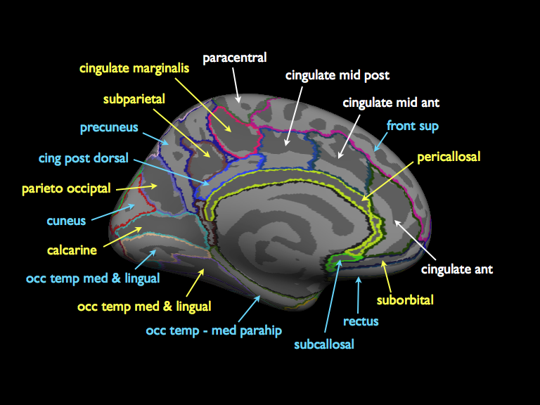

.. _freesurfer_atlases::

Freesurfer Atlases
==================

.. _definition:

Atlas Definition
----------------
The :class:`FreesurferAtlas` class is used primarily with the automatic subcortical 
segmentation and cortical parcellation of native-space T1 weighted anatomical
scans during the Freesurfer reconstruction process (recon-all).  In the near 
future, it will be possible to use this class with any atlas image that conforms
to the general characteristics of the recon-all files -- they are located in
the standard paths within the Freesufer subjects directory structure and written
such that the voxel/vertex values within of each ROI are integer ids.

.. _dictionary:

Config Dictionary
-----------------
The Freesurfer config dictionary has the following fields:

* manifold
* fname
* regions

The ``manifold`` should be either ``"volume"`` or ``"surface"``.  The ``fname``
should be the file name and extension of the source image as a string, e.g. 
``"aseg.mgz"`` or ``"aparc.annot"``.  The ``regions`` should be a list of 
integer values corresponding to the regions you wish to extract from.  
See the below for a table of ids and names.

.. _notes:

Atlas Notes
-----------

PyROI will look for the filename of a volume image in the 
$SUBJECTS_DIR/$SUBJECT/mri directory and a surface image in the 
$SUBJECTS_DIR/$SUBJECT/label directory.  

Currently, PyROI supports only the following recon-all atlases:

* aseg.mgz
* aparc.annot
* aparc.a2009s.annot

This means that you will not be able to use the Destrieux parcellation
(which defines both gyral and sulcul regions) if you processed your
T1s with a Freesurfer version older than 4.5.  See the gen_2009_parc
command-line program (which is accessible once you've sourced the
PyROI environment) for the creation of this parcellation in older
datasets.

If you are going to be sharing a dataset with other users of PyROI
(ie, you have the same basepath in your config files), it is advisable
that you name your freesufer atlases in a consistent fashion to avoid
duplicating the make-atlas processing The recommended names are "aseg",
"aparc", and "destrieux" (for the aseg.mgz, aparc.annot, and aparc.a2009s.annot
files, respectively), but no specific naming system is required.

.. _seg_ref:

Segmentation ID Tables
----------------------

The tables below provide a reference for which ids to use for which structures.
Note that, although you will only specify a region once, data will be extracted
separately from each hemisphere.  You may be interested in the :func:`find_id`
function, which will search for region ids that corresponds to a given region name.

Note also that the values in these tables differ from those of the official 
Freesurfer look up table (at $FREESURFER_HOME/FreeSurferColorLUT.txt), so don't
use them if you're running Freesurfer programs directly.

.. include:: aseg_id_table.rst

.. include:: aparc_id_table.rst

Lateral surface
^^^^^^^^^^^^^^^
.

Medial surface
^^^^^^^^^^^^^^
.

Ventral surface
^^^^^^^^^^^^^^^
. 

.. include:: aparc_2009_id_table.rst

Blue labels are gyri (names will be prepended with ``G_`` in the tables above,
yellow labels are sulci (``S_``) and white labels are combined gyral-sulcal
regions (``G_and_S_``).

Lateral surface
^^^^^^^^^^^^^^^
.

Medial surface
^^^^^^^^^^^^^^
.

Ventral surface
^^^^^^^^^^^^^^^
.

.. image:: _static/a2009s_ven.png

You may also be interested in `this PDF <http://web.mit.edu/mwaskom/www/
fsaverage_parcellations.pdf>`_ of the surface parcellations.  The Neuroimage
paper on the 2009 Destrieux atlas (see below) also has a nice graphic with
numerical ids (which will match those used by PyROI) for the different regions.

.. _Papers:

Papers
------

Subcortical segmentation:

Fischl, B., D.H. Salat, E. Busa, M. Albert, M. Dieterich, C. Haselgrove,
A. van der Kouwe, R. Killiany, D. Kennedy, S. Klaveness, A. Montillo,
N. Makris, B. Rosen, and A.M. Dale, (2002).  Whole Brain Segmentation:
Automated Labeling of Neuroanatomical Structures in the Human Brain,  
*Neuron*, **33:** 341-355.     

Desikan-Killiany cortical parcellation:

Desikan, R.S., F. Segonne, B. Fischl, B.T. Quinn, B.C. Dickerson, D. 
Blacker, R.L. Buckner, A.M. Dale, R.P. Maguire, B.T. Hyman, M.S. 
Albert, and R.J. Killiany, (2006).  An automated labeling system 
for subdividing the human cerebral cortex on MRI scans into gyral 
based regions of interest,  *NeuroImage,* **31(3):** 968-80.  

2009 Destrieux cortical parcellation:

Destrieux C., B. Fischl, A. Dale, E. Halgren, (2010).  Automatic parcel-
lation of human cortical gyri and sulci using standard anatomical 
nomenclature. *Neuroimage,* 2010 [Epub ahead of print] 

