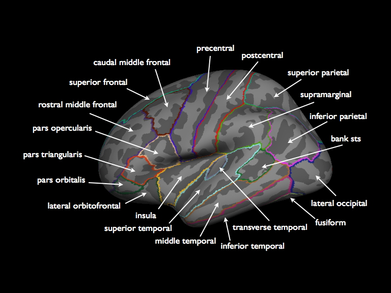
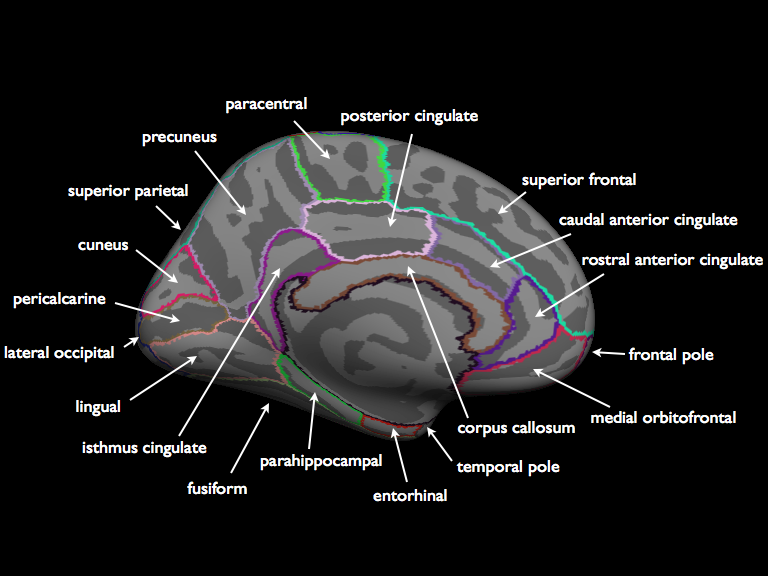
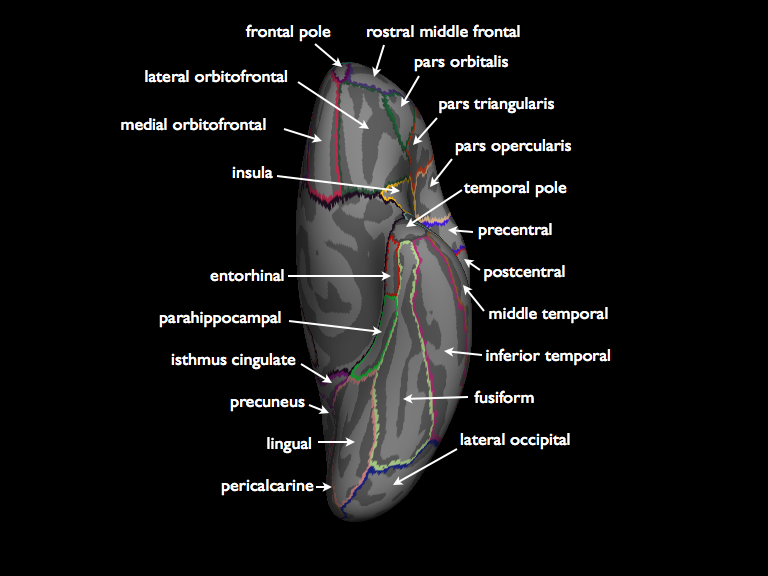
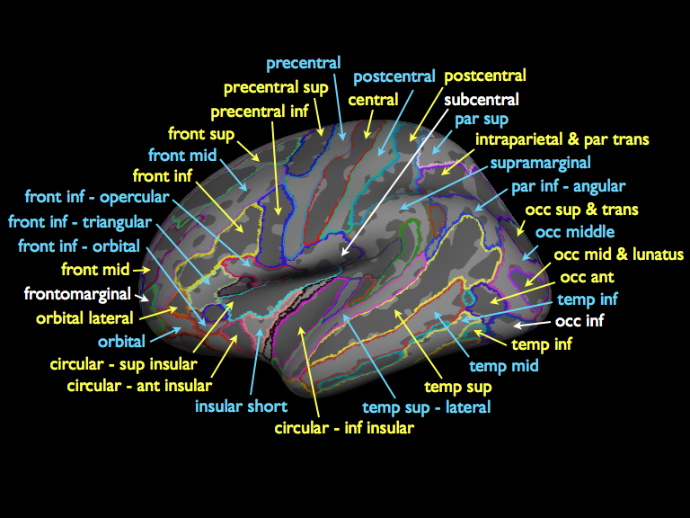
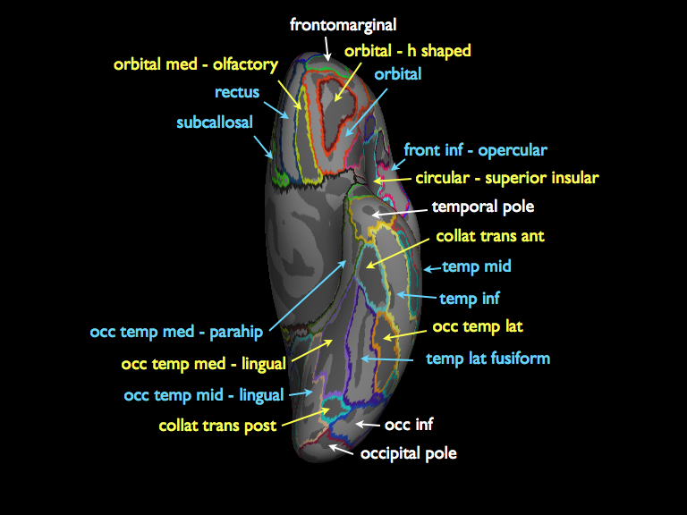

Freesurfer Surface Atlases
==========================

Desikan-Kiliany Parcellation (aka aparc.annot):

Lateral surface

Medial surface

Ventral surface

Destrieux Parcellation (aka aparc.a2009s.annot):

Blue labels are gyri, yellow labels are sulci

Lateral surface

Medial surface

Ventral surface
These images can be also be downloaded as a `PDF <http://web.mit.edu/mwaskom/www/fsaverage_parcellations.pdf>`_.
